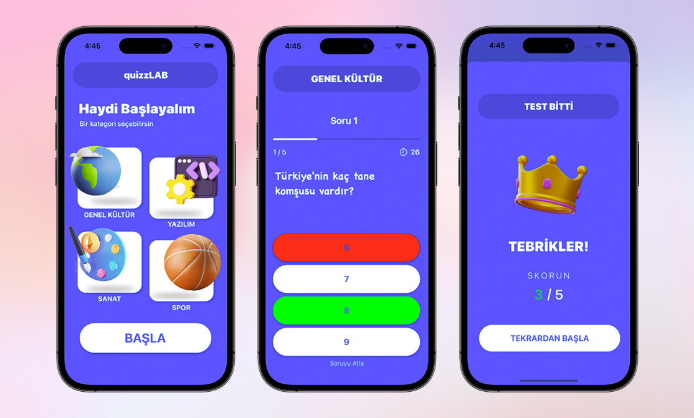

# QuizzLab - A quiz application | Midterm Exam

## Table of Contents

- [Introduction](#introduction)
- [Features](#features)
- [Screenshots](#screenshots)
- [Installation](#installation)
- [Usage](#usage)
- [Presentation](#presentation)
- [License](#license)

## Introduction

My project, QuizzLab, is my midterm project for Mobile Device Programming course. The application is developed using Swift 5 and UIKit, and includes the following features: Login screen, Register screen, Quiz category screen, Quiz screen, Final screen, Timer, and a mechanism that indicates whether the selected answer is correct or incorrect.

## Features

- Login screen
- Register screen
- Quiz category screen
- Quiz screen
- Final screen
- Timer
- Mechanism that indicates whether the selected answer is correct or incorrect

## Screenshots

## Installation

1. Clone the repository
2. Open the project in Xcode
3. Run the project

## Usage

1. Login with your username and password
2. Select a quiz category
3. Answer the questions
4. See your score

## Presentation

In my project, the LoginViewController file contains properties such as the username TextField, passwordTextField, loginButton, and registerButton. Additionally, it includes a UlView feature named statusBarView. The class methods include view-DidLoad(), viewWillAppear(), addPadding(), setupStatusBar(), and setupUI(). The LoginButtonTapped() method is used to check the entered information when the user tries to log in. The showAlert() method is used to display a notification for errors. The navigateToQuiz() method is used to redirect to the quiz screen and call the QuizViewController class.

In the RegisterViewController file, the necessary operations for the user registration screen are performed. It uses IBOutlets, ViewController Lifecycle, and custom methods. It contains four IBOutlets, a UIButton, and three UITextFields. ViewController Lifecycle includes the viewDidLoad and viewWillAppear functions. The custom methods include addPadding, setupUI, showAlert, and registerButtonTapped. Another class named User has a model that contains user information such as username and password and is added to an array named users during registration.

In the QuizViewController file, the Quiz application's QuizViewController class includes buttons for four different categories and a function for each category. The class contains the Question structure that includes the text, options, and correct answers to the questions. A custom method named setupUI() creates UI elements such as header, category buttons, and start button. Additionally, the viewDidLoad() lifecycle method, IBOutlets, and functions called when a category button is pressed (navigate ToGene|Kultur(), navigateToYazilim(), navigateToSanat(), and navigateToSpor()) are included. These functions use a special navigation method by creating separate storyboard objects for each category to transition.

Finally, the CategoryNameViewController files define the ViewController class for a quiz application. It defines IBOutlets that specify the interface elements in the storyboard. The viewDidLoad() function loads the functions, and setupUI() configures the interface elements. The showResult() function calculates the number of questions answered and the number of correct answers and displays the result screen. The checkAnswer() function checks the answer selected by the user, and incorrect answers are displayed in red. Finally, the answerButton1Tapped() function checks the selected answer against the correct answer.

## License

[MIT](https://choosealicense.com/licenses/mit/)